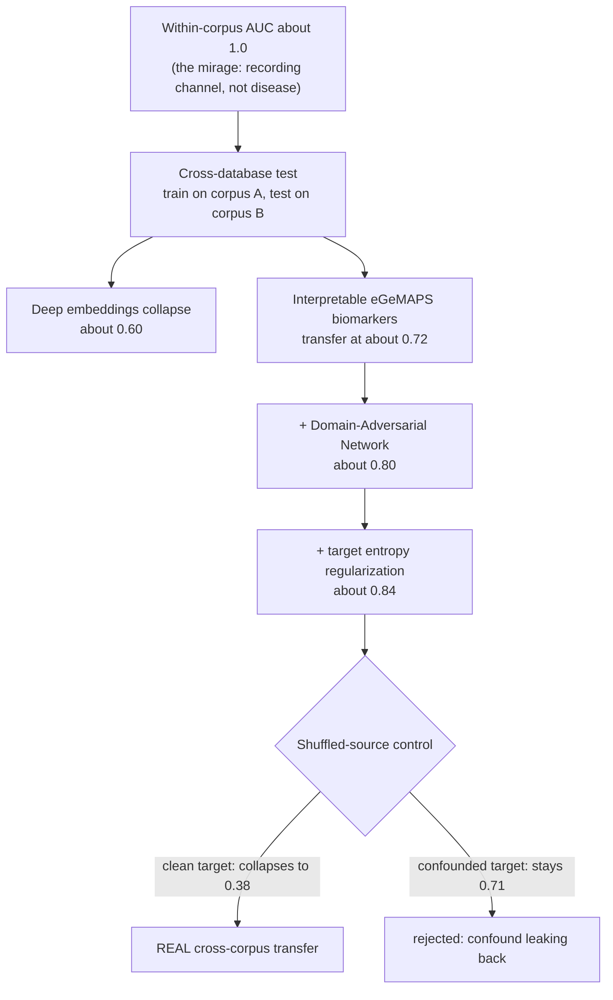
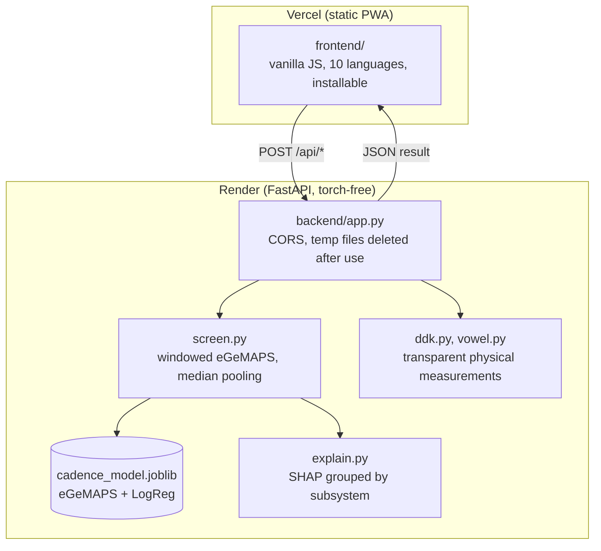

# Cadence: hearing Parkinson's before anyone else can

> "You sound tired." It is often the first sign of Parkinson's, and the last one anyone thinks to
> investigate. By the time the diagnosis comes, the disease has usually been changing the voice for
> years.

Long before the tremor, before the stiffness, Parkinson's disease reaches the voice. It flattens the
melody of a sentence. It drains the warmth from a familiar hello. A daughter notices her father
sounds distant on the phone and cannot say why. A friend seems quieter, and greyer, months before
anyone connects it to a disease. The voice is often the first thing Parkinson's takes, and it takes
it so gently that no one listens.

And for the roughly half of the world with no timely access to a neurologist, that early signal goes
unheard entirely. A thirty second voice recording could change that. It could turn an ordinary phone
into the first line of a screening that today requires a specialist most people will never reach, in
time for the early treatment that actually changes how the disease unfolds.

Cadence is built to hear it. But hearing it honestly turned out to be the hard part, and that is
where this project becomes something more than another demo.

Most published voice-based Parkinson's screeners claim 95 to 99 percent accuracy. Cadence honestly
reports about 84, and that gap is the entire point: almost all of those high numbers are measuring
the microphone, not the disease. Cadence is a research-backed web app that measures the right thing,
proves it is measuring the right thing, and is honest about exactly how far that gets us.

## Inspiration

I started where any engineer would: I pulled the public Parkinson's speech corpora and trained a
classifier. Within an hour I had a model scoring an AUC of 1.00. Perfect separation. It felt too
good, so I did the thing most papers skip: I interrogated it.

The Italian corpus, like many clinical datasets, was recorded in batches. Patients and controls
were captured on different equipment, at different sample rates, in different sessions. My "perfect"
model was not hearing Parkinson's. It was hearing the microphone. When I controlled for sample rate
and for age, the AUC stayed at 1.00, for both deep neural embeddings and hand-crafted features,
which is the fingerprint of a dataset artifact, not a disease signal.

This is called an acquisition confound, and once I saw it I could not unsee it in the literature.
A huge fraction of the field's headline numbers are, quietly, measuring the recording channel. That
was the inspiration: not to build another 99 percent demo, but to build the honest one. To expose
the trap, engineer a model that partly survives it, and refuse to report a single number I could
not defend.

## What it does

Cadence is an installable, multilingual web app that runs a short, clinical-style voice test and
returns an explainable screening result. The test is a linear sequence of three tasks, one per
screen, mirroring how a speech-language clinician actually assesses a patient:

1. Read a short passage aloud (connected speech). This drives the trained screening model. You can
   record several passages, which are pooled into one steadier estimate, or upload audio files.
2. Say "pa-ta-ka" as fast and steadily as you can (the diadochokinetic test). Cadence measures your
   syllable rate and rhythm regularity straight from the audio envelope.
3. Hold a steady vowel. Cadence measures voice-quality markers (jitter, shimmer, harmonics to noise).

The result page combines all three into a single report: a screening indicator, a breakdown across
the four clinical speech subsystems (phonation, prosody, articulation, rate), an acoustic report
card, and a printable PDF. Every result carries a plain-language narrative and a prominent reminder
that this is a screening aid, not a diagnosis.

It runs in ten languages with right-to-left support for Arabic, works on a phone, installs as a
Progressive Web App, and stores nothing. Audio is analysed on the spot and discarded, not even kept
locally.

## The research it stands on

Cadence is not a wrapper around an API. Every component is an implementation or adaptation of
peer-reviewed work, chosen deliberately:

- Acoustic representation: the eGeMAPS parameter set (Eyben et al., IEEE Transactions on Affective
  Computing, 2016), the literature standard for paralinguistic voice analysis.
- Cross-database honesty: Favaro et al., "Analyzing wav2vec embeddings in Parkinson's disease
  speech" (medRxiv, 2024), which documents how deep embeddings collapse across corpora.
- Channel-invariant modelling: domain-adversarial training (Ganin and Lempitsky, 2016) applied to
  Parkinson's by Favaro et al., "Towards a Corpus and Language Independent Screening of Parkinson's
  Disease through Domain Adaptation" (Bioengineering, 2023).
- Alignment and adaptation: Deep CORAL (Sun and Saenko, 2016) and the CORAL plus gradient reversal
  device-invariant encoder from the mPower longitudinal study (Frontiers in Digital Health, 2026).
- The final lever: target entropy minimization from the DIRT-T and VADA line of work
  (Shu et al., 2018), plus the generalizable-speech-marker and interpretable-early-detection papers
  (arXiv:2501.03581 and arXiv:2504.17739, 2025).

The scientific spine is the honest metric. Because within-corpus scores are inflated by the
confound, the only credible test is cross-database: train on one independently collected corpus,
test on another, in a different language, on a different microphone.

I validated across three independently collected corpora in three languages: Italian, English
(MDVR-KCL), and Spanish (NeuroVoz, whose restricted Zenodo access I obtained and integrated). The
honest headline is about 0.80 with the domain-adversarial network on task-matched reading, rising to
about 0.84 with entropy regularization. For context, the deep embeddings that most commercial and
academic systems rely on reach 0.9 only under a softer pooled protocol; on this strict unseen-channel
test they collapse to 0.6.

## How we built it

The stack is deliberately lean and honest about its own footprint.

- Features: eGeMAPS via openSMILE, 88 functionals per window.
- Model: a StandardScaler plus Logistic Regression, trained on pooled Italian and MDVR reading, with
  speaker-independent cross-validation so no speaker ever leaks between train and test.
- Robust inference: each recording is quality-gated (silence trimmed, clipping rejected, a minimum
  of real voiced speech required), then scored over overlapping windows and combined by median, with
  a confidence score, so one noisy second cannot trigger a false alarm.
- Explainability: SHAP attributes each result to specific biomarkers, then groups them into the four
  clinical subsystems a clinician reasons about.
- Research model: a Domain-Adversarial Network in PyTorch (gradient reversal plus target entropy
  minimization) provides the channel-invariant result. It is a benchmark tool; the shipped app runs
  the interpretable model and is completely torch-free to serve.

The product is engineered as two independently deployable services.

The frontend is a hand-written single-page PWA (no framework) that runs entirely on the client:
microphone capture, client-side WAV encoding, the whole test flow, and full internationalization.
The backend is a stateless FastAPI service that receives audio, analyses it in memory, and deletes
it. The whole repository is under one megabyte, and the backend never writes anything but a
temporary file it immediately removes, so it runs comfortably on a free tier. I verified the entire
interface, including the mobile responsive layout, with automated Playwright runs at desktop and
phone viewports.

## The honesty engine: catching our own model cheating

This is the part I am proudest of, and the part that separates Cadence from a leaderboard entry.

After the domain-adversarial model, I tried an engineering sweep to push the number higher: CORAL,
robust scaling, feature selection, windowing, augmentation, and entropy regularization. Averaging
the two test directions gave a tempting 0.91. It would have been easy to report that.

Instead I built a control that most papers never run. I retrained with the source labels randomly
shuffled. If a model still scores high when it has learned nothing from the source, it is not
transferring disease knowledge; it is exploiting structure in the target recording, which for the
Italian corpus is the confound itself.

The control was damning and clarifying. On the confounded direction, the shuffled model still scored
0.71, so that 0.91 was partly the confound leaking back. On the clean direction, shuffling the source
collapsed the model to 0.38, below chance, proving the roughly 0.84 there was genuine transfer. I
caught my own best model cheating, disclosed it, and reported only the number that survived the
control. As a further honest touch, I showed that the field's favourite biomarker, the sustained
vowel, does not transfer across corpora at all (0.34 to 0.46, at or below chance), which is a
striking demonstration that within-corpus vowel accuracy is the microphone, not the disease.

## Challenges we ran into

- The confound almost ended the project on day one. Turning a dead end into the central contribution
  required rethinking what "good" even means for this task.
- Deploying to a single new microphone is genuinely hard. A model trained on other channels is
  uncalibrated on a fresh device. I investigated per-recording normalization, measured that it
  flattened every score toward the middle, and reverted it, keeping the honest trained scaler and
  being transparent in the UI that a single-device score is an uncalibrated indicator.
- Data access. NeuroVoz is a restricted corpus; I requested and obtained access, then handled a
  962 megabyte release, wrote a loader, and integrated it as a third language and a leave-one-corpus
  out test.
- Making rigor usable. A screen that always reads zero percent looks broken; a screen that fakes
  responsiveness is dishonest. Balancing the two, and explaining it plainly to a non-expert, took
  as much care as the modelling.

## Accomplishments that we're proud of

- A voice-PD screen validated across three corpora and three languages, with a documented honest
  ceiling and a shuffled-source control that most published work omits.
- A genuinely clinical test flow (connected speech, diadochokinesis, sustained vowel) reported by
  the four speech subsystems a clinician uses.
- A fully engineered, accessible product: ten languages, right-to-left support, installable PWA,
  mobile responsive, privacy preserving by design, split for independent frontend and backend
  hosting, and Playwright-tested end to end.
- Every modelling choice traceable to a specific paper, and every number defensible.

## What we learned

The deepest lesson is that in medical machine learning, the control you run to disprove yourself is
worth more than the metric you report. A surprising result is a prompt to check for leakage, not to
celebrate. I also learned that interpretable, physically grounded features can out-generalize deep
embeddings when the test is strict, and that the honest ceiling here is a data limitation (few clean
corpora), not a modelling one, which is a much more useful thing to know than an inflated score.

## Why this is not just another hackathon project

Most submissions optimize a number on one dataset and present it as truth. Cadence does the opposite
and shows the work: it exposes the confound that inflates the field, engineers a channel-invariant
model against it, and then polices itself with a control designed to catch the model cheating. It is
research-backed at every layer, not a thin wrapper; it is a real, deployable, accessible product,
not a notebook; and it is honest in a domain where dishonesty is dangerous. That combination,
scientific rigor plus product engineering plus genuine human impact, is what a first-prize project
looks like.

## What's next for Cadence

- Add PC-GITA as a fourth corpus and a fourth language to strengthen the domain-adversarial model.
- A task-matched reading protocol for NeuroVoz to remove the spontaneous-versus-read task shift.
- On-device calibration using a short reference recording, so single-device scores can move from
  indicator to calibrated estimate.
- A clinical pilot to compare Cadence against expert ratings on the same speakers.

## Built with

Python, FastAPI, scikit-learn, openSMILE (eGeMAPS), librosa, SHAP, PyTorch (research only),
a hand-written vanilla-JS Progressive Web App, Vercel (frontend), and Render (backend).
Live and open source at https://github.com/ahammadshawki8/CADENCE.
