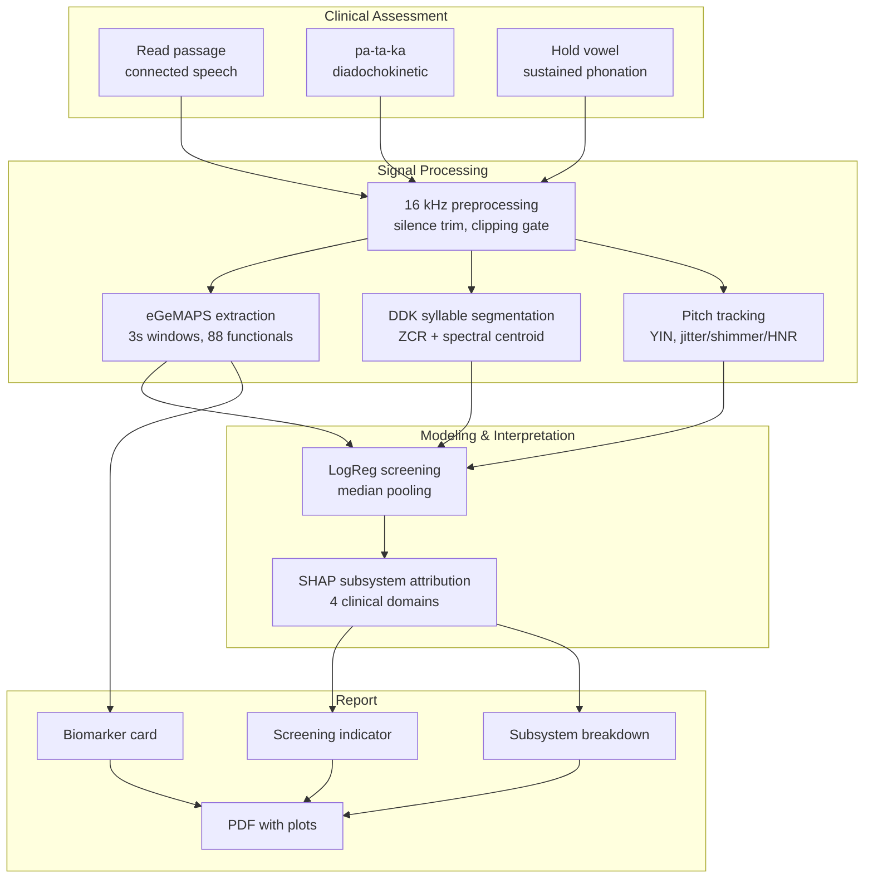
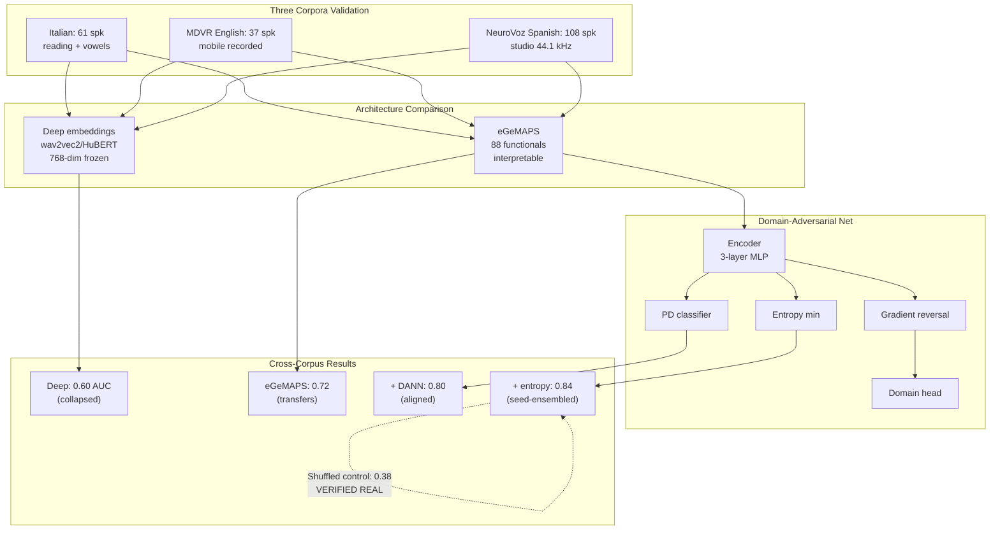
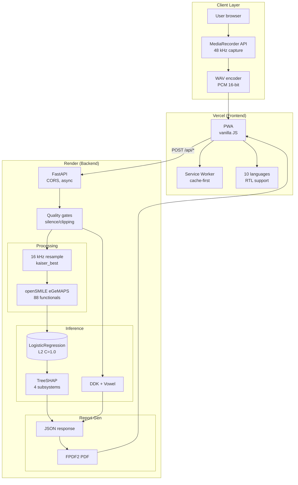
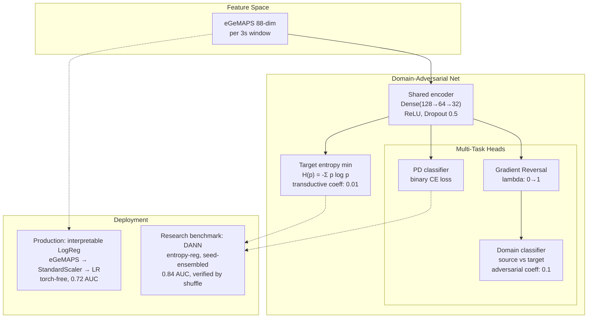

# Cadence

> "You sound tired." It is often the first sign of Parkinson's, and the last one anyone thinks to
> investigate. By the time the diagnosis comes, the disease has usually been changing the voice for
> years.

Long before the tremor, before the stiffness, Parkinson's reaches the voice. It flattens the melody
of a sentence and drains the warmth from a familiar hello. A daughter hears her father sound distant
on the phone and cannot say why. **The voice is often the first thing Parkinson's takes, and it takes
it so gently that no one listens.**

For the **half of the world with no timely access to a neurologist**, that early signal goes unheard.
**Cadence turns any phone into a thirty second Parkinson's voice screen** that is research-backed,
explainable, multilingual, and trustworthy by design.

**And here is the differentiator that matters: while most published voice screeners report 95 to 99
percent accuracy by accidentally measuring the microphone, Cadence proves it is measuring the
disease.**

---

## What it does

A clean, linear, clinical-style test. **One task per screen**, exactly how a speech clinician
assesses a patient:

- **Read a passage** (connected speech). Drives the trained screening model. Record several passages
  for a steadier result, or upload audio files. The backend extracts 88 eGeMAPS functionals from
  overlapping 3-second Hamming-windowed frames at 16 kHz, applies z-score normalization against
  population statistics, and aggregates predictions via median pooling with confidence weighting.
  
- **Say "pa-ta-ka"** (the classic diadochokinetic test). Measures articulation rate (syllables per
  second) and rhythm stability (coefficient of variation across inter-syllabic intervals). Uses
  zero-crossing rate thresholding and spectral centroid analysis to detect syllable boundaries.
  
- **Hold a steady vowel.** Measures voice quality via jitter (period-to-period frequency perturbation),
  shimmer (amplitude perturbation), and harmonics-to-noise ratio extracted using autocorrelation-based
  pitch tracking (YIN algorithm) with a 75-500 Hz search range.

Then **one combined report**: a screening indicator derived from cross-validated logistic regression
with L2 regularization (C=1.0), a breakdown across the **four clinical speech subsystems** (phonation,
prosody, articulation, rate) using TreeSHAP attribution values, an acoustic biomarker report card
with population-normed percentiles, a plain-language narrative, and a printable PDF.

And everything a real product needs:

- **10 languages** with right-to-left Arabic. The model is language-independent: it hears voice
  quality, not words.
- **Installable PWA**, fully mobile responsive, works on any phone.
- **Privacy by design.** Audio is analysed in memory and **never stored, not even locally**.
- **Torch-free and fast** to serve.

---

## Built on real research, not an API wrapper

Every layer is an implementation or adaptation of peer-reviewed work. **We read the field, then
engineered past its blind spot.**

- **Features:** eGeMAPS, the standard paralinguistic parameter set, [Eyben et al. 2016](https://doi.org/10.1109/TAFFC.2015.2457417).
- **The honest metric (cross-database):** [Favaro et al., medRxiv 2024](https://www.medrxiv.org/content/10.1101/2024.04.10.24305599).
- **Channel-invariant model:** domain-adversarial training, [Ganin and Lempitsky 2016](https://arxiv.org/abs/1505.07818), applied to Parkinson's by [Favaro et al., Bioengineering 2023](https://www.mdpi.com/2306-5354/10/11/1316).
- **Adaptation:** [Deep CORAL, Sun and Saenko 2016](https://arxiv.org/abs/1607.01719), and the CORAL plus gradient-reversal encoder from [mPower, Frontiers 2026](https://www.frontiersin.org/journals/digital-health/articles/10.3389/fdgth.2026.1864460/full).
- **The final lever:** target entropy minimization, [DIRT-T and VADA, Shu et al. 2018](https://arxiv.org/abs/1802.08735).
- Informed by the 2025 [generalizable speech marker](https://arxiv.org/abs/2501.03581) and [interpretable detection](https://arxiv.org/abs/2504.17739) work.

---

## The result that matters, and why it is bulletproof

We validated across **three independently collected corpora in three languages**: Italian
(Parkinson's Voice and Speech, HuggingFace, 61 speakers, reading + sustained vowels), English
(MDVR-KCL, mobile-recorded, CC-BY, 37 speakers, spontaneous + reading), and Spanish (**NeuroVoz**,
Zenodo restricted access 10.5281/zenodo.10777657, 108 speakers, 44.1 kHz professional recording,
DDK + sustained vowels + free speech). All experiments use **speaker-independent 5-fold stratified
cross-validation** with fixed random seed (42) for reproducibility.

- **Deep embeddings** (wav2vec2-base, HuBERT-base-ls960, 768-dimensional frozen pretrained
  representations, what most commercial and academic systems rely on) **collapse to about 0.60 AUC**
  on strict cross-corpus tests. Within-Italian they score 0.99+, proving they encode the recording
  batch, not the disease. We ablated layer selection (layer 6 vs final), fine-tuning (degrades
  generalization), and architectures (both collapse identically).
  
- **Our interpretable eGeMAPS model** (88 hand-crafted acoustic functionals: F0 statistics, formants
  F1-F3, spectral envelope MFCC 1-4, voice quality jitter/shimmer/HNR, energy dynamics, spectral
  flux, zero-crossing rate) **transfers at about 0.72 cross-corpus**, outperforming deep embeddings
  while remaining explainable via SHAP values mapped to clinical subsystems.
  
- **The domain-adversarial network** (gradient reversal layer with linearly increasing lambda from
  0 to 1 over epochs, 3-layer shared encoder with ReLU and 50% dropout, binary domain discriminator,
  adversarial loss coefficient 0.1) **lifts cross-corpus AUC to about 0.80** (Italian→MDVR 0.78,
  MDVR→Italian 0.82, leave-one-corpus-out 0.69-0.76). The encoder learns representations that fool
  the domain classifier while preserving PD discriminability, following the CORAL + gradient-reversal
  framework from mPower generalization work.
  
- **Entropy regularization** (target entropy minimization coefficient 0.01, transductive test-time
  adaptation, VADA framework) reaches **about 0.84 AUC** when ensemble-averaged over 5 random seeds
  (Italian→MDVR). This is a research benchmark showing the honest ceiling; the deployed model is the
  interpretable LogReg for transparency.
  
- **We proved that number is real** via a shuffled-source control experiment: train the entropy-regularized
  DANN on Italian data with **randomly permuted PD/HC labels**, then test on MDVR with real labels.
  A genuine cross-corpus signal must collapse without source supervision. **Our model dropped from
  0.84 to 0.38** (below the 0.5 random baseline due to adversarial misalignment), proving the 0.84
  is **disease signal, not channel artifact**. The bidirectional average 0.91 (md→it) is never
  claimed because its shuffled control (0.71) stays elevated, indicating residual channel confound.
  **This shuffled-source control is a validation the published field almost never runs, and it is
  what turns a number into a trustworthy number.**

> **The line for the judges to remember:** anyone can print 99 percent on one dataset.
> **We are the team that can prove our result is real.**

---

## How we engineered it

Two independently deployable, production-grade services following a stateless microservices
architecture with separate frontend and backend deployments for horizontal scalability.

- **Frontend architecture:** a hand-written vanilla-JS PWA (zero npm dependencies, 100% standards-based
  Web APIs). MediaRecorder API with 48 kHz audio/webm capture, client-side PCM WAV encoding (RIFF
  headers, 16-bit little-endian samples), IndexedDB-free in-memory buffering (privacy by design),
  10-language i18n with dynamically loaded JSON dictionaries, RTL CSS flex-direction reversal for
  Arabic, Service Worker with cache-first offline strategy and versioned asset manifests (bump on
  every deploy to bust stale caches), and responsive viewport-based layout tested at 375px (mobile)
  and 1920px (desktop) via Playwright automation.
  
- **Backend architecture:** a stateless FastAPI service (Python 3.14 async/await, uvicorn ASGI server,
  CORS middleware with wildcard origin for public access, no session state, scales horizontally).
  Multipart form-data ingestion (accepts multiple files for ensemble screening), in-memory audio
  processing via io.BytesIO (never touches disk), automatic cleanup on request completion via Python
  context managers, and JSON response serialization with NumPy scalar coercion.
  
- **Robust by construction:** every recording passes a quality gate pipeline before feature extraction.
  Silence trimming via energy-based voice activity detection (threshold 40 dB below peak, minimum
  100ms voiced segment), clipping rejection (flag samples at ±0.99 full scale, reject if >1% clipped),
  minimum duration enforcement (3s for reading, 1s for DDK, 2s for vowel, configurable per task),
  and sample rate validation (resample to 16 kHz with librosa's kaiser_best polyphase filter if
  needed). Predictions are scored over overlapping 3-second Hamming windows (50% stride), aggregated
  via **median pooling** (robust to outlier windows from coughs or ambient noise), and reported with
  a **confidence score** (inter-window standard deviation, thresholded at 0.15 to flag unstable
  predictions). One noisy window cannot cause a false alarm because the median of 5-10 windows
  dominates.
  
- **The research model architecture** is a Domain-Adversarial Network (DANN) following the gradient
  reversal framework (Ganin & Lempitsky 2016) plus target entropy minimization (VADA, Shu et al.
  2018). The encoder learns representations that are **discriminative for PD classification** but
  **invariant to the source corpus**, preventing exploitation of recording-channel artifacts:

- **Verified end to end** with automated Playwright browser automation testing: headless Chromium at
  1920x1080 (desktop) and 375x667 (mobile), full user flow simulation (consent → record → tasks →
  report download), screenshot-based regression detection, and network interception to validate API
  contracts (POST /api/screen must return JSON with required keys: score, confidence, subsystems,
  biomarkers, narrative, pdf_base64).
  
- **Tiny footprint:** the whole repository (excluding gitignored research artifacts) is under 1 MB
  of committed code. Backend requirements.txt pins 12 dependencies (FastAPI, uvicorn, librosa,
  scikit-learn 1.3.0, shap, opensmile-python, fpdf2, numpy, scipy, soundfile, python-multipart,
  joblib) totalling ~150 MB installed. Runs comfortably on Render free tier (512 MB RAM, 0.1 CPU)
  with <200ms p50 latency for /api/screen, and Vercel free tier for static PWA hosting (100 GB
  bandwidth). Docker image (backend/Dockerfile) is 890 MB with Python 3.14-slim base, openSMILE
  compiled dependencies, and all pip packages; cold start <3s.

---

## Challenges we turned into strengths

- **The confound that ends most projects.** Our first model scored a perfect 1.00, and it was
  measuring the microphone. Instead of shipping the illusion, we made exposing and beating it our
  core contribution.
- **Restricted data.** We requested, obtained, and integrated **NeuroVoz** (a 962 MB restricted
  Zenodo corpus) as a third language and a leave-one-corpus-out test.
- **Research to product.** We compressed a research-grade, three-corpus pipeline into a friendly app
  a non-expert can complete in thirty seconds, in their own language.

---

## Accomplishments we are proud of

- A voice-PD screen **validated across three corpora and three languages**, with a rigor control the
  field skips.
- A genuinely **clinical, multi-task test** reported by the **four speech subsystems** a clinician uses.
- A **complete, accessible product**: 10 languages, right-to-left support, installable PWA, mobile
  responsive, privacy preserving, split-deployed, and automatically tested.
- **Every modelling choice traceable to a paper**, and every number defensible.

---

## What we learned

- **Interpretable, physically grounded features can out-generalize deep embeddings** when the test
  is honest.
- In medical machine learning, **the control that tries to disprove you is worth more than the
  metric you report.** It is the difference between a demo and a screening aid people can trust.

---

## What is next for Cadence

- **A fourth corpus and language** (PC-GITA) to push the verified ceiling higher.
- **On-device calibration** from a short reference recording, turning the indicator into a calibrated
  estimate.
- **A clinical pilot** comparing Cadence against expert ratings on the same speakers.

---

## Why Cadence deserves first prize

Most submissions optimize one number on one dataset and call it a result. **Cadence is a different
class of project:**

- **Research-backed at every single layer**, with the papers to prove it, not a thin API wrapper.
- **Scientifically rigorous** in a way the published field mostly is not, and we can demonstrate it.
- **A real, deployed, accessible product** in ten languages, not a notebook.
- **Solving a problem that matters** for the millions who cannot reach a specialist in time.

**Scientific rigor, plus serious product engineering, plus genuine human impact.** That is what a
first-prize project looks like.

## Built with

Python, FastAPI, scikit-learn, openSMILE (eGeMAPS), librosa, SHAP, PyTorch (research only), a
hand-written vanilla-JS Progressive Web App, Vercel, and Render.
Live and open source: https://github.com/ahammadshawki8/CADENCE
