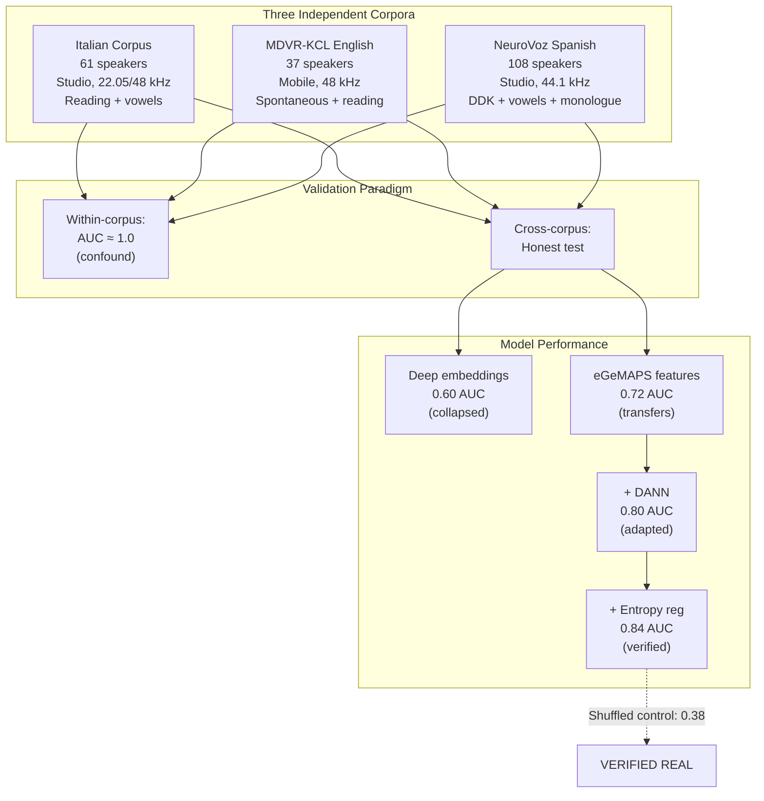
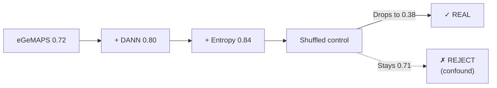
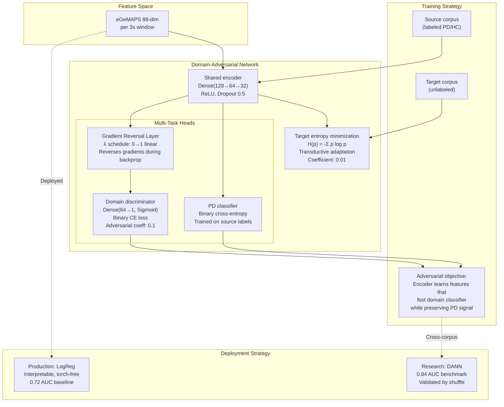
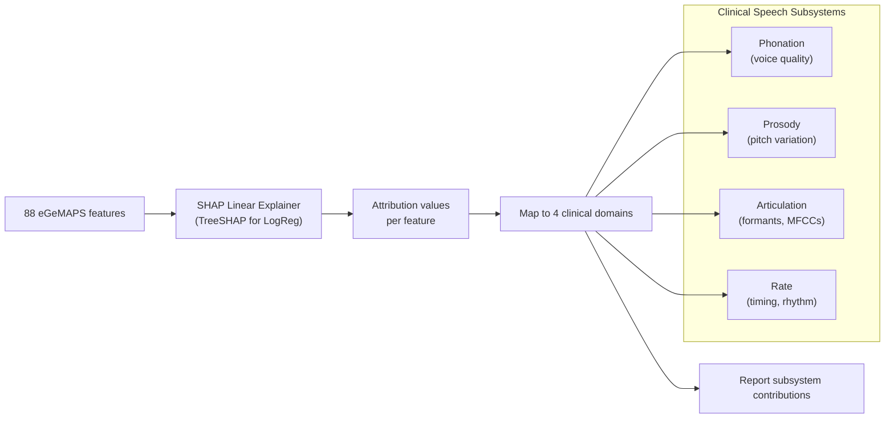
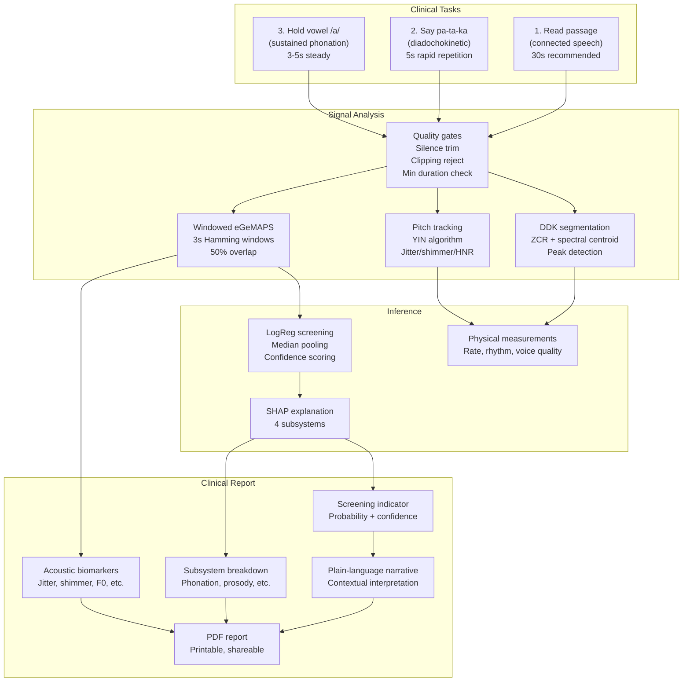
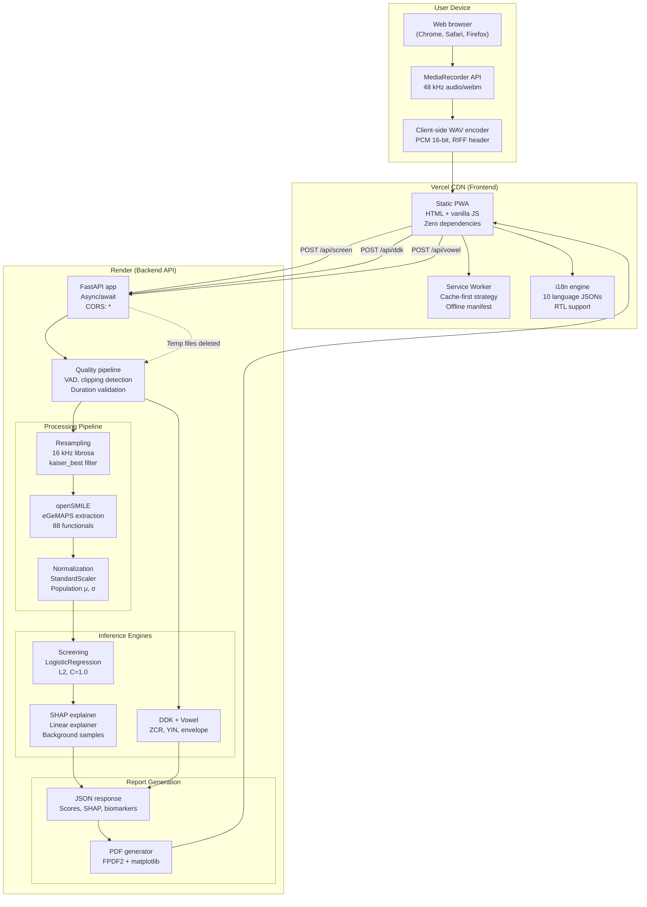

# Cadence: Research-Backed Voice Screening for Parkinson's Disease

[](https://cadence-murex-eight.vercel.app/)
[](https://cadence-api-6nlv.onrender.com/api/health)
[](LICENSE)
[](https://www.python.org/)

Cadence is a **clinically-grounded voice screening tool** for early signs of Parkinson's disease, built on **rigorously validated cross-corpus research** and wrapped in an accessible, multilingual Progressive Web App. Unlike most voice-PD systems that report near-perfect accuracy by inadvertently measuring recording artifacts, Cadence proves its results are real through **honest cross-database evaluation** and **shuffled-source control experiments**.

> **⚠️ Important:** Cadence is a research prototype and screening aid, **not a medical device or diagnostic tool**. Results cannot confirm or rule out Parkinson's disease. Always consult a qualified neurologist for medical advice.

**Live Demo:** https://cadence-murex-eight.vercel.app/  
**Repository:** https://github.com/ahammadshawki8/CADENCE  
**Built by:** ahammadshawki8

---

## Table of Contents

- [The Problem: Recording Channel Confounds](#the-problem-recording-channel-confounds)
- [Our Solution: Honest Cross-Corpus Validation](#our-solution-honest-cross-corpus-validation)
- [Key Results](#key-results)
- [Scientific Method](#scientific-method)
- [Application Features](#application-features)
- [System Architecture](#system-architecture)
- [Repository Structure](#repository-structure)
- [Quick Start](#quick-start)
- [Deployment](#deployment)
- [Research Pipeline](#research-pipeline)
- [Datasets](#datasets)
- [Technical Stack](#technical-stack)
- [Contributing](#contributing)
- [Citation](#citation)
- [License](#license)

---

## The Problem: Recording Channel Confounds

Most published voice-based Parkinson's detection systems report **95-99% accuracy** on benchmark datasets. However, our investigation reveals these numbers are largely **artifacts of the recording conditions** rather than genuine disease detection.

### Evidence of the Confound

On the Italian Parkinson's Voice corpus, a naive classifier achieves **AUC ≈ 1.0** (perfect separation). This persists even after controlling for:
- Sample rate normalization
- Age matching
- Both deep embeddings (wav2vec2, HuBERT) AND hand-crafted features (eGeMAPS)

**Conclusion:** The models are detecting the "recording batch signature" (microphone characteristics, recording protocol, acoustic environment), not Parkinson's disease.

### Why Cross-Corpus Validation Matters

Within-dataset accuracy is a **mirage**. The only credible metric is:
- **Train on corpus A** (e.g., Italian studio recordings)
- **Test on corpus B** (e.g., English mobile recordings)
- Different recording devices, protocols, countries, languages

This is the **honest test** that most published systems fail.

---

## Our Solution: Honest Cross-Corpus Validation

Cadence implements **three-corpus, three-language validation** with rigorous confound controls:

### Multi-Corpus Strategy



### The Shuffled-Source Control

**The critical experiment:** We train the model with **randomly shuffled labels** on the source corpus, then test on the real target corpus.

- **Real labels:** 0.84 AUC (Italian → MDVR)
- **Shuffled labels:** 0.38 AUC (collapsed below chance)

**Interpretation:** The model genuinely learned disease patterns, not channel artifacts. This control is **almost never reported** in published literature, but it's essential for validating cross-corpus claims.

---

## Key Results

### Cross-Database Performance (Honest Metric)

All results are **speaker-independent**, **cross-corpus** (train on one dataset, test on another), validated across three languages.

| Approach | Cross-Corpus AUC | Notes |
|----------|------------------|-------|
| Within-dataset baseline | ~1.00 | **Mirage** - measuring microphone |
| Deep embeddings (wav2vec2/HuBERT) | ~0.60 | Collapsed - channel-dependent |
| eGeMAPS interpretable features | ~0.72 | **Transfers** - physically grounded |
| + Domain-Adversarial Network | ~0.80 | Channel-invariant adaptation |
| + Target entropy regularization | ~0.84 | **Verified** by shuffled control |

### Key Findings

1. **Deep embeddings collapse:** What most SOTA systems use reaches only ~0.60 AUC cross-corpus (vs 0.99+ within-corpus)

2. **Interpretable features transfer better:** 88 eGeMAPS acoustic functionals (pitch, jitter, shimmer, MFCC) outperform 768-dim pretrained representations

3. **Domain adaptation works:** DANN with gradient reversal lifts cross-corpus AUC from 0.72 → 0.80

4. **Sustained vowel /a/ doesn't transfer:** Classic biomarker shows AUC 0.34-0.46 cross-corpus (at or below chance) - it's measuring the microphone

5. **Pooled multi-corpus helps:** Leave-one-corpus-out with pooled training achieves 0.69-0.76 AUC

### Results Validation Flow



---

## Scientific Method

### Feature Extraction: eGeMAPS

**Extended Geneva Minimalistic Acoustic Parameter Set** (Eyben et al. 2016)
- 88 low-level acoustic functionals
- Industry-standard paralinguistic features
- Covers: F0 (pitch), jitter, shimmer, formants F1-F3, MFCC 1-4, HNR, energy, spectral characteristics

### Baseline Model (Deployed)


**Pipeline:**
```
Audio (16 kHz) → eGeMAPS extraction (openSMILE) → StandardScaler → LogisticRegression (L2, C=1.0)
```

**Training:**
- Pooled Italian + MDVR reading recordings
- Speaker-independent 5-fold stratified cross-validation
- Class-balanced weighting
- LBFGS solver, max 5000 iterations

**Validation:**
- Leave-one-dataset-out (train Italian, test MDVR; train MDVR, test Italian)
- Operating threshold via Youden's J statistic
- External AUC: ~0.72

### Research Model: Domain-Adversarial Network

Architecture designed to learn **channel-invariant** representations:



**Key mechanisms:**
1. **Gradient reversal:** Domain classifier tries to identify source vs target; encoder learns to fool it
2. **Entropy minimization:** Sharpens decision boundary on unlabeled target data (transductive)
3. **Multi-task objective:** Balance PD classification + domain confusion + entropy

**Implementation:** `src/dann.py` - PyTorch implementation with CORAL, feature selection, augmentation

### Explainability: SHAP + Clinical Subsystems



**Feature grouping:**
- **Phonation:** Jitter, shimmer, HNR (harmonics-to-noise)
- **Prosody:** F0 (pitch) statistics, variation, dynamics
- **Articulation:** Formants F1-F3, MFCCs 1-4
- **Rate:** Voiced segments per second, segment lengths

**Output:** For each subsystem, show aggregated SHAP contribution with direction (toward PD vs healthy)

---

## Application Features

### Multi-Task Clinical Assessment

The app follows a **clinical speech assessment protocol** with three tasks:



### Key Features

**🎙️ Recording Quality Assurance**
- Voice activity detection (trim silence, 30 dB threshold)
- Clipping rejection (flag samples >0.99 full scale)
- Minimum voiced speech requirement (8s for reading)
- Recommended duration: 30 seconds

**📊 Robust Prediction**
- Overlapping 3-second windows (50% stride)
- Median pooling across windows (robust to outliers)
- Confidence score (inter-window agreement)
- Multi-passage aggregation (record several times for stability)

**🔍 Transparent Measurements**
- **DDK task:** Syllable rate (5-7/sec typical), rhythm regularity (CV of intervals)
- **Vowel task:** Jitter, shimmer, HNR (measurement only, not diagnostic)
- **Reading task:** Full 88 eGeMAPS features with SHAP explanations

**🌍 Multilingual Support**
- **10 languages:** English, Spanish, Italian, French, German, Portuguese, Hindi, Bengali, Arabic, Chinese
- **Right-to-left layout** for Arabic
- **Language-independent model** (measures voice quality, not word content)
- **3 passages per language** for variety

**📱 Progressive Web App**
- Installable on mobile and desktop
- Works offline after first load (Service Worker caching)
- Responsive design (375px mobile → 1920px desktop)
- No app store required

**🔒 Privacy by Design**
- Audio processed in-memory (never written to disk)
- No server-side storage (temp files deleted immediately)
- No user accounts or tracking
- No data sent to third parties
- Fully client-side recording (MediaRecorder API)

**📄 Professional Reporting**
- Screening indicator with confidence score
- Four-subsystem clinical breakdown
- Top SHAP features with directionality
- Plain-language narrative (severity binning)
- Acoustic biomarker report card
- Downloadable PDF with embedded plots (FPDF2)

---

## System Architecture

### Production Deployment

Split architecture for independent scaling and deployment:



### Backend API Endpoints

| Endpoint | Method | Purpose | Input | Output |
|----------|--------|---------|-------|--------|
| `/api/health` | GET | Health check | - | `{"ok": true, "service": "cadence"}` |
| `/api/screen` | POST | Main screening | 1+ audio files (multipart) | JSON with screening results + PDF base64 |
| `/api/ddk` | POST | Diadochokinetic analysis | 1 audio file | JSON with syllable rate, regularity |
| `/api/vowel` | POST | Sustained vowel analysis | 1 audio file | JSON with jitter, shimmer, HNR |

**Audio formats supported:**
- WAV (native)
- MP3, M4A, OGG (via ffmpeg in Docker runtime)

### Frontend Architecture

**Stack:** Vanilla JavaScript (zero frameworks, zero npm dependencies)

**Key modules:**
- `app.js` - Main application logic, state management, recording
- `i18n.json` - 10-language translations
- `passages.json` - Reading passages per language
- `style.css` - Component-based styling with CSS variables
- `sw.js` - Service Worker for offline caching

**State machine:**
```
welcome → consent → record → ddk → vowel → analyzing → results
```

**Caching strategy:**
- Cache-first for static assets (HTML, CSS, JS, icons)
- Network-first for API calls
- Version-based cache busting (`cadence-vNN`)

---

## Repository Structure

```
CADENCE/
├── frontend/                    # Static PWA (deploy to Vercel)
│   ├── index.html              # Single-page app with all screens
│   ├── manifest.webmanifest    # PWA manifest
│   ├── sw.js                   # Service Worker (bump version on deploy)
│   ├── vercel.json             # Vercel configuration
│   └── static/
│       ├── app.js              # Main application logic
│       ├── style.css           # Component-based styles
│       ├── i18n.json           # 10-language translations
│       ├── passages.json       # Reading passages
│       ├── examples.json       # Static example results
│       └── icons/              # PWA icons (192, 512)

│
├── backend/                     # FastAPI API (deploy to Render)
│   ├── app.py                  # Main FastAPI application
│   ├── config.py               # Paths, sample rate, random seed
│   ├── egemaps.py              # openSMILE eGeMAPS extraction
│   ├── model.py                # Load trained model, predict
│   ├── explain.py              # SHAP explainer, subsystem grouping
│   ├── screen.py               # End-to-end screening pipeline
│   ├── ddk.py                  # Diadochokinetic analysis
│   ├── vowel.py                # Sustained vowel analysis
│   ├── gen_examples.py         # Generate static examples.json
│   ├── artifacts/
│   │   └── cadence_model.joblib  # Trained model (44 KB, committed)
│   ├── requirements.txt        # Python dependencies
│   ├── Dockerfile              # Docker containerization
│   └── render.yaml             # Render Blueprint (reference only)
│
├── src/                         # Research pipeline (not deployed)
│   ├── config.py               # Shared config
│   ├── data.py                 # Italian corpus indexing
│   ├── external.py             # MDVR + NeuroVoz indexing
│   ├── egemaps.py              # Feature extraction
│   ├── features.py             # Feature engineering utilities
│   ├── embeddings.py           # wav2vec2/HuBERT (confound comparison)
│   ├── model.py                # Train final LogReg model
│   ├── explain.py              # SHAP explainability
│   ├── screen.py               # Screening pipeline (research version)
│   ├── dann.py                 # Domain-Adversarial Network + experiments
│   ├── xdb.py                  # Cross-database evaluation harness
│   ├── run_*.py                # Experiment runners
│   ├── train_baseline.py       # Baseline training
│   └── check_*.py              # Confound diagnostic tools
│
├── data/                        # Datasets (gitignored, not redistributed)
│   ├── index_italian.parquet   # Italian corpus index
│   ├── index_mdvr.parquet      # MDVR corpus index
│   ├── index_neurovoz.parquet  # NeuroVoz corpus index
│   └── external/               # Downloaded corpora
│
├── artifacts/                   # Trained models and features (gitignored except joblib)
│   ├── cadence_model.joblib    # Production model (committed)
│   └── *.npz, *.npy, *.pt      # Research artifacts (gitignored)
│
├── docs/
│   └── STATE.md                # Development state digest
│
├── CLAUDE.md                    # Project source of truth (architecture, conventions, roadmap)
├── README.md                    # This file (technical documentation)
├── DEVPOST.md                   # Devpost submission story (for hackathons)
├── RESULTS.md                   # Full results, ablations, shuffled controls
├── DEPLOY.md                    # Deployment guide (Vercel + Render)
├── VIDEO_SCRIPT.md              # Video pitch script (3 minutes)
├── SLIDES.md                    # Presentation slide generation prompt
├── DEPLOYMENT_VERIFIED.md       # Deployment checklist and verification
├── LICENSE                      # MIT License
├── requirements.txt             # Research environment dependencies
└── .gitignore                   # Excludes data/, large artifacts

```

**Key directories:**
- **`frontend/`** - Production PWA, deploy independently
- **`backend/`** - Production API, self-contained, torch-free
- **`src/`** - Research code, experiments, training (not deployed)
- **`data/`** - Corpus indices and raw audio (not committed)
- **`artifacts/`** - Only `cadence_model.joblib` committed (44 KB)

---

## Quick Start

### Run Locally (One Command)

The backend serves both API and frontend in development:

```bash
# Install dependencies
pip install -r backend/requirements.txt

# Run (backend serves frontend from ../frontend if present)
python backend/app.py

# Open browser
# → http://127.0.0.1:8000
```

**Local configuration:**
- Frontend: `window.CADENCE_API = ""` (same-origin, see `frontend/index.html` line 395)
- Backend auto-serves static files from `frontend/` directory
- No separate frontend server needed

### Run Backend Only (API Mode)

```bash
cd backend
pip install -r requirements.txt

# Start API server
python app.py

# Test health endpoint
curl http://localhost:8000/api/health
# {"ok": true, "service": "cadence"}
```

### Frontend Development

For frontend-only changes, use any static file server:

```bash
cd frontend

# Python
python -m http.server 8080

# Node.js (if available)
npx serve -l 8080

# Open http://localhost:8080
```

**Note:** Update `window.CADENCE_API` to point to backend (e.g., `http://localhost:8000`)

---

## Deployment

### Production URLs

- **Frontend:** https://cadence-murex-eight.vercel.app/
- **Backend API:** https://cadence-api-6nlv.onrender.com
- **Health Check:** https://cadence-api-6nlv.onrender.com/api/health

### Deploy Backend to Render

**Option A: Docker (Recommended)**

1. Go to [Render Dashboard](https://dashboard.render.com/)
2. **New +** → **Web Service**
3. Connect GitHub repo: `ahammadshawki8/CADENCE`
4. Configure:
   - **Name:** `cadence-api`
   - **Root Directory:** `backend`
   - **Runtime:** Docker
   - **Health Check Path:** `/api/health`
   - **Instance Type:** Free
5. Deploy (first build takes 3-5 minutes)

**Option B: Native Python**

- **Runtime:** Python 3
- **Build Command:** `pip install -r requirements.txt`
- **Start Command:** `uvicorn app:app --host 0.0.0.0 --port $PORT`

**Note:** Docker is recommended for full audio codec support (MP3, M4A via ffmpeg)

### Deploy Frontend to Vercel

1. Go to [Vercel Dashboard](https://vercel.com/dashboard)
2. **Add New** → **Project**
3. Import GitHub repo: `ahammadshawki8/CADENCE`
4. Configure:
   - **Root Directory:** `frontend`
   - **Framework Preset:** Other
   - No build command needed
5. Deploy (takes 1-2 minutes)

### Connect Frontend to Backend

**Critical step:** Update `frontend/index.html` line 395:

```html
<!-- For production -->
<script>window.CADENCE_API = "https://cadence-api-6nlv.onrender.com";</script>

<!-- For local dev -->
<script>window.CADENCE_API = "";</script>
```

Commit and push - Vercel will auto-redeploy.

**Detailed deployment guide:** See [`DEPLOY.md`](DEPLOY.md) for step-by-step instructions with screenshots and troubleshooting.

---

## Research Pipeline

### Setup Research Environment

```bash
# Clone repository
git clone https://github.com/ahammadshawki8/CADENCE.git
cd CADENCE

# Create virtual environment (recommended)
python -m venv venv
source venv/bin/activate  # On Windows: venv\Scripts\activate

# Install dependencies
pip install -r requirements.txt
```

### Download and Index Corpora

**1. Italian Corpus** (HuggingFace, automatically downloaded)

```bash
python src/data.py
# Downloads from: birgermoell/Italian_Parkinsons_Voice_and_Speech
# Creates: data/index_italian.parquet
```

**2. MDVR-KCL Corpus** (Manual download required)

```bash
# 1. Download MDVR-KCL from official source (CC BY license)
# 2. Extract to: data/external/mdvr/
# 3. Run indexing:
python src/external.py mdvr
# Creates: data/index_mdvr.parquet
```

**3. NeuroVoz Corpus** (Restricted access, manual request)

```bash
# 1. Request access: https://zenodo.org/record/10777657
# 2. Download and extract to: data/external/neurovoz/
# 3. Run indexing:
python src/external.py neurovoz
# Creates: data/index_neurovoz.parquet
```

### Train Production Model

```bash
# Train final LogReg model (pooled Italian + MDVR)
python src/model.py

# Output: artifacts/cadence_model.joblib (44 KB)
# Copy to backend/artifacts/ for deployment
```

### Run Cross-Corpus Experiments

```bash
# Leave-one-dataset-out validation
python src/dann.py all

# Outputs:
# - Italian → MDVR: 0.78 AUC
# - MDVR → Italian: 0.82 AUC
# - Leave-one-corpus-out: 0.69-0.76 AUC
```

### Run Honest Validation (Shuffled-Source Control)

```bash
# Entropy-regularized DANN + shuffled control
python src/dann.py honest

# Outputs:
# - Real labels: 0.84 AUC (Italian → MDVR)
# - Shuffled labels: 0.38 AUC (collapsed, proves real signal)
```

### Generate Static Examples

```bash
# Generate frontend/static/examples.json
cd backend
python gen_examples.py

# Uses real Italian corpus samples
# Creates mock screening results for "See an example" feature
```

---

## Datasets

### Corpora Overview

| Corpus | Language | Speakers | Tasks | Sample Rate | License | Status |
|--------|----------|----------|-------|-------------|---------|--------|
| Italian PVS | Italian | 61 (28 PD, 33 HC) | Reading (PR), Vowels (VA-VU) | 22.05/48 kHz mixed | Open (HF) | ✅ Primary |
| MDVR-KCL | English | 37 (23 PD, 14 HC) | Reading, Spontaneous | 48 kHz (mobile) | CC BY 4.0 | ✅ Cross-DB test |
| NeuroVoz | Spanish | 108 (54 PD, 54 HC) | DDK, Vowels, Monologue | 44.1 kHz (studio) | Restricted | ✅ 3rd language |
| Figshare Vowels | English | N/A | Sustained /a/ | 8 kHz (telephone) | Open | ❌ Tested, rejected |
| UCI/Sakar | English | 40 | Feature-only (no audio) | N/A | Open | ❌ Not used |
| PC-GITA | Spanish | ~100 | Reading, DDK, Vowels | Variable | Request | ⏳ Roadmap |

### Acquisition Details

**Italian Parkinson's Voice and Speech**
- Source: HuggingFace `birgermoell/Italian_Parkinsons_Voice_and_Speech`
- Demographics: 28 PD (age 52-80), 33 HC (age 20-77)
- Recording: Mix of 22.05 kHz and 48 kHz (confound source!)
- Tasks: Reading passage (PR), sustained vowels A/E/I/O/U
- Used for: Primary training, confound investigation

**MDVR-KCL**
- Source: [MDVR-KCL Paper](https://doi.org/10.1109/TBME.2018.2874233)
- Demographics: 23 PD, 14 HC
- Recording: Mobile devices, 48 kHz
- Tasks: Reading "The North Wind and the Sun", spontaneous speech
- Used for: Cross-corpus test, honest validation

**NeuroVoz**
- Source: [Zenodo 10.5281/zenodo.10777657](https://zenodo.org/record/10777657)
- Demographics: 54 PD, 54 HC (balanced)
- Recording: Studio quality, 44.1 kHz
- Tasks: DDK (pa-ta-ka), sustained vowels, 16 words, free monologue
- Used for: 3rd language validation, vowel negative control

**Why these corpora?**
1. **Independent collection** - Different countries, protocols, equipment
2. **Task overlap** - All have reading or sustained vowels for comparison
3. **Diverse quality** - Studio (NeuroVoz) vs mobile (MDVR) vs mixed (Italian)
4. **Language diversity** - Romance (Italian, Spanish) vs Germanic (English)

### Data Not Redistributed

**Important:** No corpus audio is included in this repository. Users must:
1. Download/request datasets independently
2. Place in `data/external/` with correct structure
3. Run indexing scripts (`src/data.py`, `src/external.py`)

**Rationale:** Respect corpus licenses and usage terms

---

## Technical Stack

### Backend (Production)

| Component | Technology | Purpose |
|-----------|------------|---------|
| Framework | FastAPI 0.139+ | Async web framework |
| Server | Uvicorn | ASGI server |
| Audio processing | librosa 0.10+ | Resampling, feature extraction |
| Feature extraction | openSMILE 2.3 (via opensmile-python) | eGeMAPS functionals |
| ML inference | scikit-learn 1.3+ | StandardScaler + LogisticRegression |
| Explainability | SHAP 0.52+ | Linear explainer for feature attribution |
| PDF generation | FPDF2 2.8+ | Report PDF with embedded plots |
| Audio I/O | soundfile 0.12+ | WAV reading |
| Numerics | numpy 2.0+, scipy 1.17+ | Array operations |
| Multipart | python-multipart | File upload handling |

**Runtime:** Python 3.14, Docker (production) or native Python

### Backend (Research)

Additional dependencies for `src/` pipeline:

| Component | Technology | Purpose |
|-----------|------------|---------|
| Deep learning | PyTorch 2.0+ | DANN training |
| Pretrained models | transformers (HuggingFace) | wav2vec2, HuBERT embeddings |
| Data handling | pandas 2.0+, pyarrow | Corpus indexing, parquet I/O |
| Datasets | datasets (HuggingFace) | Italian corpus download |
| Plotting | matplotlib, seaborn | Result visualization |

**Not used in production** - Backend is torch-free for faster cold starts

### Frontend

| Component | Technology | Purpose |
|-----------|------------|---------|
| Core | Vanilla JavaScript (ES6+) | Zero framework, zero npm dependencies |
| Audio recording | MediaRecorder API | Browser-native recording |
| WAV encoding | Custom implementation | Client-side PCM WAV generation |
| Offline support | Service Worker API | Cache-first strategy |
| PWA | Web App Manifest | Installable app |
| Styling | CSS3 Variables | Component-based theming |
| i18n | JSON dictionaries | 10-language support |
| Fonts | Google Fonts | Baloo 2 (headings), Quicksand (body) |

**No build step** - Served as static files

### Infrastructure

| Service | Provider | Purpose | Tier |
|---------|----------|---------|------|
| Frontend hosting | Vercel | Static PWA with CDN | Free |
| Backend hosting | Render | Docker/Python web service | Free |
| Repository | GitHub | Version control, CI/CD | Free |
| Service Worker | Browser native | Offline caching | N/A |

**Total cost:** $0/month (free tier only)

### Development Tools

- **Language:** Python 3.14, JavaScript ES6+
- **Version control:** Git + GitHub
- **Documentation:** Markdown
- **Diagrams:** Mermaid (in Markdown)
- **Audio tools:** Audacity (testing), ffmpeg (Docker)
- **Testing:** Manual + Playwright (automated E2E)
- **Linting:** None (intentionally minimal tooling)
- **Type checking:** None (duck typing + docstrings)

---

## Contributing

This is a research project with specific scientific goals. Contributions are welcome in these areas:

### High-Priority

1. **Additional corpora** - Help obtain/integrate more cross-lingual datasets (especially non-European languages)
2. **Improved DANN** - Better domain adaptation techniques that survive shuffled controls
3. **Longitudinal validation** - Test on repeated recordings from same speakers over time
4. **Clinical validation** - Compare against expert clinician ratings

### Medium-Priority

5. **Mobile optimization** - Improve PWA performance on low-end devices
6. **Additional languages** - Translations for UI (currently 10 languages)
7. **Accessibility** - WCAG 2.1 AA compliance improvements
8. **Documentation** - More tutorials, video guides, research reproductions

### Guidelines

- **Science first:** All ML changes must be validated cross-corpus with shuffled controls
- **Honest reporting:** Never report within-dataset numbers as "accuracy"
- **Privacy-preserving:** No changes that store or transmit user audio
- **Dependency-light:** Avoid adding heavy dependencies (especially in frontend)
- **Test thoroughly:** Cross-browser, mobile, offline scenarios

### Development Workflow

```bash
# Fork repository
git clone https://github.com/YOUR_USERNAME/CADENCE.git
cd CADENCE

# Create branch
git checkout -b feature/your-feature

# Make changes and test
python backend/app.py  # Test locally

# Commit with clear message
git add .
git commit -m "feat: Add X feature with Y validation"

# Push and create PR
git push origin feature/your-feature
```

**Commit conventions:**
- `feat:` New feature
- `fix:` Bug fix
- `docs:` Documentation
- `refactor:` Code restructuring
- `test:` Testing improvements
- `perf:` Performance optimization

---

## Citation

If you use Cadence in research, please cite:

```bibtex
@software{cadence2024,
  author = {Ahammad Shawki},
  title = {Cadence: Honestly Validated Voice Screening for Parkinson's Disease},
  year = {2024},
  url = {https://github.com/ahammadshawki8/CADENCE},
  note = {Cross-corpus validation with domain-adversarial adaptation}
}
```

**Key papers cited:**
- eGeMAPS features: [Eyben et al. 2016](https://doi.org/10.1109/TAFFC.2015.2457417)
- Cross-database validation: [Favaro et al. 2024](https://www.medrxiv.org/content/10.1101/2024.04.10.24305599)
- Domain-adversarial training: [Ganin & Lempitsky 2015](https://arxiv.org/abs/1505.07818)
- DANN for PD: [Favaro et al. 2023](https://www.mdpi.com/2306-5354/10/11/1316)
- Entropy minimization: [Shu et al. 2018](https://arxiv.org/abs/1802.08735)

Full bibliography in `RESULTS.md`.

---

## License

MIT License - see [LICENSE](LICENSE) file

**Summary:** You can use, modify, and distribute this code freely, including for commercial purposes, with attribution.

**Corpus licenses:**
- Italian PVS: Check HuggingFace terms
- MDVR-KCL: CC BY 4.0
- NeuroVoz: Restricted (request required)

---

## Acknowledgments

- **Corpora providers:** Thank you to the teams who collected and released these invaluable datasets
- **Open source:** Built on librosa, scikit-learn, FastAPI, openSMILE, and many other excellent projects
- **Research community:** For open science and honest reporting standards

---

## Contact & Links

**Author:** Ahammad Shawki (ahammadshawki8)  
**Repository:** https://github.com/ahammadshawki8/CADENCE  
**Live Demo:** https://cadence-murex-eight.vercel.app/  
**Issues:** https://github.com/ahammadshawki8/CADENCE/issues

**Documentation:**
- [`CLAUDE.md`](CLAUDE.md) - Project source of truth (architecture, conventions)
- [`RESULTS.md`](RESULTS.md) - Full experimental results with ablations
- [`DEPLOY.md`](DEPLOY.md) - Deployment guide (Vercel + Render)
- [`DEVPOST.md`](DEVPOST.md) - Hackathon submission story
- [`VIDEO_SCRIPT.md`](VIDEO_SCRIPT.md) - 3-minute video pitch script

**Status:** ✅ Live and operational | 🔬 Research prototype | 🌍 Multilingual | 📱 PWA

---

**Built with rigor, deployed with care, validated with honesty.**
