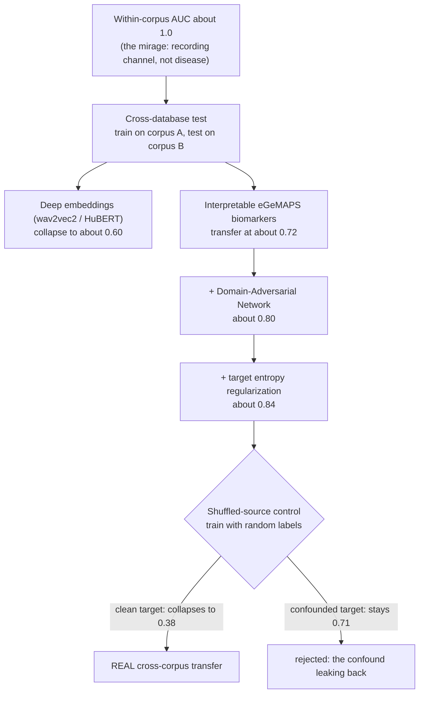
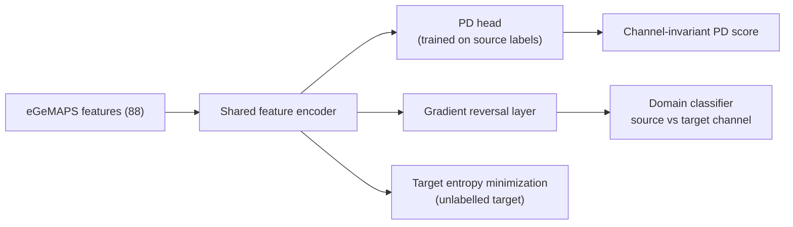
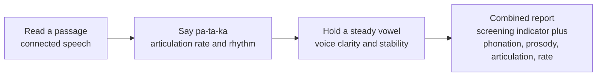
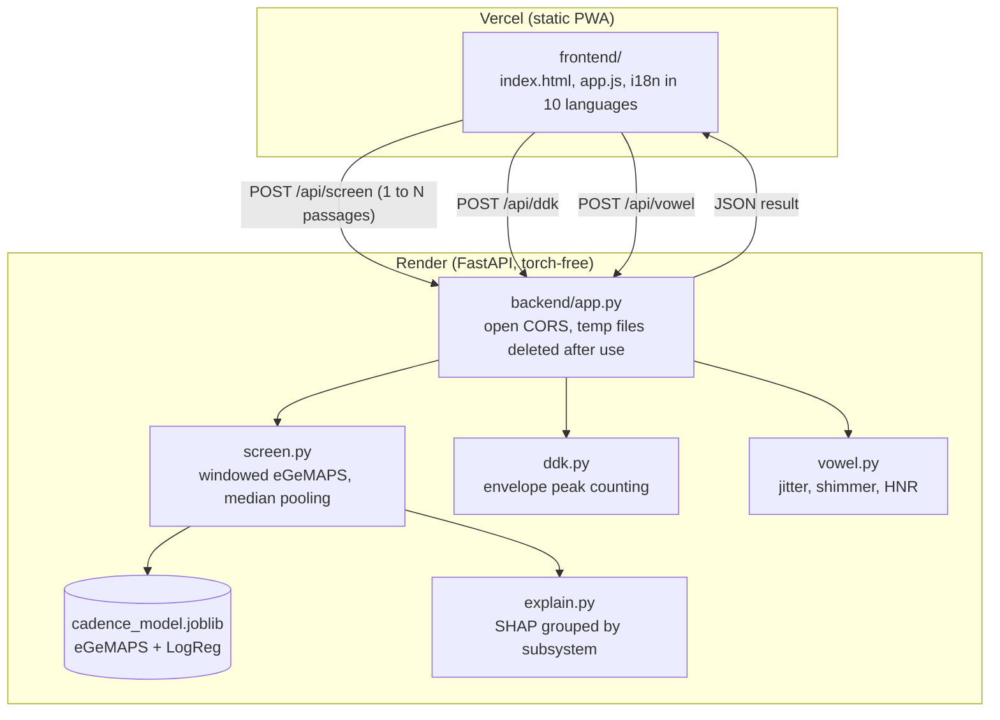

# Cadence: Honestly Validated Voice Screening for Parkinson's Disease

Cadence screens for signs of Parkinson's disease (PD) from a short voice recording, using
**interpretable acoustic biomarkers** and **domain-adversarial adaptation**, wrapped in a friendly,
**multilingual, installable web app**. Its distinguishing goal is **honest, confound-aware
evaluation**: most voice-PD systems report near-perfect accuracy that actually reflects dataset
*recording artifacts*, not the disease. Cadence exposes that trap and reports performance
**across independently collected corpora and languages**.

> **Not a medical device.** Cadence is a research prototype and screening aid, not a diagnosis.

Repository: https://github.com/ahammadshawki8/CADENCE  |  Built by **ahammadshawki8**.

## The core finding

On the Italian Parkinson's corpus a naive classifier reaches **AUC about 1.0**, but this persists
even after controlling for sample rate *and* age, for **both** deep embeddings *and* hand-crafted
features. The models are detecting the recording "batch signature", not PD. So within-dataset
numbers are a mirage; the only credible metric is **cross-database** (train on one corpus, test on an
independently collected one).

## Results (all honest, cross-database, speaker-independent)

| Approach (strict unseen-channel test, Italian vs MDVR-KCL) | AUC |
|---|---|
| Within-dataset (the mirage) | ~1.00 |
| Deep embeddings (wav2vec2 / HuBERT), collapse | ~0.60 |
| Interpretable eGeMAPS biomarkers | ~0.72 |
| eGeMAPS + Domain-Adversarial Network (DANN) | ~0.80 |
| + target entropy regularization (shuffle-verified) | ~0.84 |

We don't just *diagnose* the confound: a gradient-reversal domain classifier makes the features
**channel-invariant**, lifting honest cross-lingual AUC to ~0.80 on task-matched reading. Deep speech
embeddings (what most SOTA and commercial systems use) reach ~0.9 only under softer *pooled*
validation; on our strict test they collapse.

The screen is validated across **three independently collected corpora in three languages** (Italian,
English, and Spanish via NeuroVoz). Three honest findings sharpen the story:

1. Once several diverse corpora are pooled, that diversity alone gives about 0.69 to 0.76 on a
   held-out corpus and adversarial adaptation adds little on top; DANN's clear win is the
   single-source to single-target case.
2. The field's favourite biomarker, the **sustained vowel, does not transfer at all** across corpora
   (AUC about 0.34 to 0.46, at or below chance): within-corpus vowel "accuracy" is the microphone,
   not the disease.
3. A systematic engineering push (CORAL, feature selection, windowing, augmentation, and
   entropy-regularized domain adaptation) raises the honest cross-corpus AUC to **~0.84**, but a
   **shuffled-source control** exposed that a tempting ~0.91 "average" was our own model
   re-discovering the Italian confound; only the clean-target direction survives the control. We
   caught our own method cheating. See `RESULTS.md` section 5 for the full sweep and the control.



## Method

Raw audio, resampled to 16 kHz, becomes **eGeMAPS** acoustic functionals (openSMILE), then a
StandardScaler plus Logistic Regression (the shipped model) with **speaker-independent**
cross-validation and **leave-one-dataset-out** cross-database evaluation. A **Domain-Adversarial
Network** (`src/dann.py`) provides channel-invariant adaptation (the ~0.80 result). Predictions are
explained with **SHAP**, grouped into the clinical speech subsystems a clinician uses (phonation,
prosody, articulation, rate).

The domain-adversarial network makes the encoder blind to the recording channel: a gradient-reversal
layer trains a domain classifier that the encoder learns to fool, while target entropy minimization
sharpens the decision boundary on the unlabelled target corpus.



## The app

A simple, linear, multi-step test with one task per screen:

**Read a passage  ->  say "pa-ta-ka"  ->  hold a steady vowel  ->  results**

- **Reading (the screening model).** Reads a short passage; **quality-gated** (trims silence, rejects
  clipping, requires at least 8 s of real voiced speech) and scored over overlapping windows
  aggregated by median, with a **confidence** score, so one noisy second cannot create a false alarm.
  You can record **several passages**, pooled into one steadier estimate, or upload audio files.
- **Articulation (pa-ta-ka).** The classic diadochokinetic test; measures syllable rate and rhythm
  regularity from the amplitude envelope, a transparent physical measurement with no model.
- **Sustained vowel.** Voice-quality markers (jitter, shimmer, harmonics-to-noise). Measurement only,
  since our own study showed the vowel does not transfer across recording channels.
- **Results** combine all three steps: a screening indicator, a clinical-subsystem breakdown, an
  acoustic report card, and a printable PDF, with a prominent "not a diagnosis" panel.
- **Multilingual:** full UI and reading passages in **10 languages** (en, es, it, fr, de, pt, hi, bn,
  ar, zh), right-to-left for Arabic. The model is language-independent (it measures voice quality,
  not words).
- **Installable PWA**, mobile responsive, and **privacy-preserving**: audio is analysed on the spot
  and discarded, and **nothing is stored**, not even locally.
- **Torch-free inference** (librosa, openSMILE, scikit-learn, SHAP).

## Architecture and workflow

The clinical test is a linear sequence. The two optional tasks are transparent, model-free
measurements, while the reading task drives the trained screening model.



The app is split into a static frontend and a stateless API, deployed independently. Audio is
analysed in memory and never stored.



## Repository layout

| Path | Purpose |
|------|---------|
| `frontend/` | Static installable PWA (deploy to Vercel). |
| `backend/` | FastAPI screening API, self-contained and torch-free (deploy to Render). |
| `src/` | Research and training pipeline (data, features, cross-database experiments, DANN). |
| `RESULTS.md` | Full results, ablations, and the shuffled-source control. |
| `DEPLOY.md` | Step-by-step deployment (Vercel and Render). |
| `CLAUDE.md` | Project source of truth (architecture, conventions, roadmap). |

## Run it locally

One process serves both the frontend and the API:

```bash
pip install -r backend/requirements.txt
python backend/app.py       # -> http://127.0.0.1:8000
```

Reproduce the research (separate environment):

```bash
pip install -r requirements.txt
python src/data.py          # download and index the Italian corpus
python src/external.py      # MDVR-KCL + NeuroVoz (after unzipping into data/external/)
python src/dann.py honest   # domain-adversarial result + shuffled-source control (~0.84)
```

## Deploy

`frontend/` goes to Vercel, `backend/` goes to Render. The frontend finds the backend via
`window.CADENCE_API` in `frontend/index.html`. Full steps are in [`DEPLOY.md`](DEPLOY.md).

## Data

- **Italian Parkinson's Voice and Speech** (primary): HuggingFace
  `birgermoell/Italian_Parkinsons_Voice_and_Speech`.
- **MDVR-KCL** (English, mobile): cross-database test corpus (CC BY).
- **NeuroVoz** (Spanish): 3rd corpus, 108 subjects, 44.1 kHz (Zenodo, restricted access granted).
  Adds a 3rd language and a leave-one-corpus-out test; its spontaneous monologue and sustained-vowel
  controls are reported honestly in `RESULTS.md`.
- **Figshare telephone vowels**: tested; the 8 kHz channel gap is too large to help (documented
  honestly).

None of the corpus audio is redistributed in this repository.

## Status

Finalised, with three-corpus and three-language validation (Italian, English, Spanish), a linear
multi-task clinical flow, and a split frontend and backend ready for Vercel plus Render. Roadmap:
add PC-GITA as a 4th corpus, and a task-matched reading protocol for NeuroVoz. See `CLAUDE.md`.
